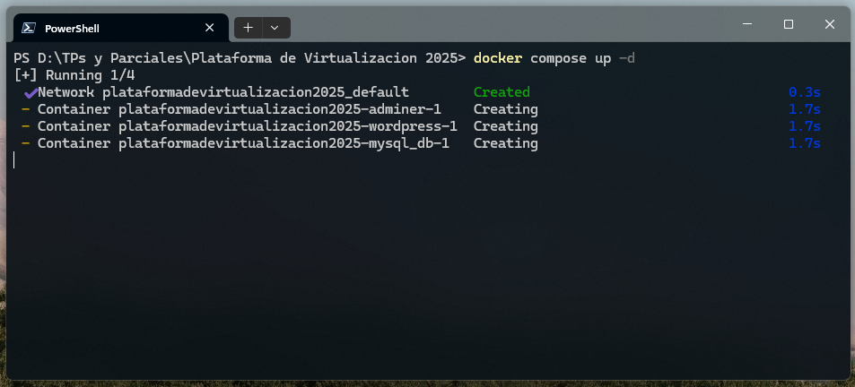
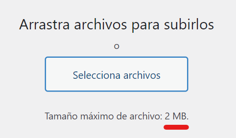
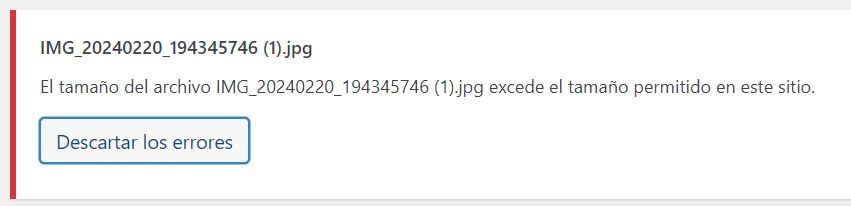
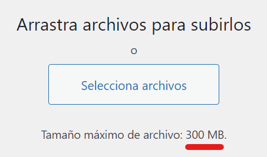
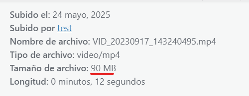

# Deploy de Wordpress y MySQL en Docker
### IMPORTANTE: Los usuarios y contraseñas configurados son básicos, a modo de prueba. Se pueden cambiar modificando el archivo `docker-compose.yml`
#### Pasos para la instalación:  

*  Crear un nuevo directorio para trabajar.
*  Descargar allí el archivo [docker-compose.yml](./docker-compose.yml).
*  Abrir una terminal de comandos en dicho directorio y ejecutar `docker compose up -d`.
*  Se crearán los contenedores de Wordpress, MySQL y Adminer para administrar la DB en caso de necesitarlo, los cuales quedarán ejecutandose en los puertos 8080, 3306 y 8081 respectivamente.

  
  

## ¿Cómo sacar el límite de subida de 2 MB a Wordpress?
Wordpress por defecto tiene un límite a la hora de subir archivos multimedia.  

   

Para evitarlo, hay 2 posibles soluciones:

### Usando un montaje desde el host:
* Borrar el archivo `docker-compose.yml` previamente descargado para proceder a trabajar con el nuevo.
* Descargar al directorio de trabajo los archivos [uploads.ini](./uploads.ini) y [docker-compose-mount.yml](./docker-compose-mount.yml).
* Renombrar `docker-compose-mount.yml` a `docker-compose.yml`.
* Abrir una terminal de comandos en el directorio y ejecutar `docker compose up -d`.
* No borrar el archivo uploads.ini, servirá para mantener la configuración activa.

### Armando una imagen personalizada de Wordpress con el límite modificado:
* Borrar cualquier `docker-compose.yml` que haya en el directorio.
* Descargar allí los archivos [docker-compose-build.yml](./docker-compose-build.yml), [Dockerfile](./Dockerfile) y [uploads.ini](./uploads.ini).
* Renombrar `docker-compose-build.yml` a `docker-compose.yml`.
* Abrir una terminal de comandos en el directorio y ejecutar `docker compose up -d`.
* Una vez armada la imagen, el archivo uploads.ini puede borrarse, aunque debe estar si se quiere compilar otra vez la imagen.   

   
    

## Fuentes usadas para el armado de los archivos:
Wordpress: [https://hub.docker.com/_/wordpress](https://hub.docker.com/_/wordpress)  
MySQL: [https://hub.docker.com/_/mysql](https://hub.docker.com/_/mysql)  
Adminer: [https://hub.docker.com/_/adminer/](https://hub.docker.com/_/adminer/)  
Configuración del límite de tamaño en wp: [https://stackoverflow.com/questions/42983276/wordpress-docker-wont-increase-upload-limit](https://stackoverflow.com/questions/42983276/wordpress-docker-wont-increase-upload-limit)

